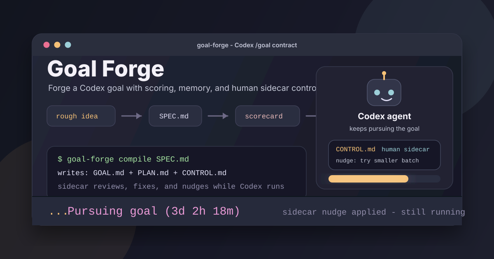

# goal-forge



Codex skill that turns a rough coding idea into a Codex `/goal`-ready contract.

Pipeline: **rough idea → interviewed `SPEC.md` → tightened `SPEC.md` → `GOAL.md` → config readiness check**.

Goal Forge now treats long-running `/goal` work as a runtime system with four explicit parts:

- **Scorecard** — the metric, checklist, threshold, regression checks, and stop condition Codex should use to judge progress.
- **Feedback loop** — the fastest representative check Codex can run repeatedly while iterating, plus the slower final check used before completion.
- **Working memory** — markdown files such as `PLAN.md`, `ATTEMPTS.md`, and `NOTES.md` that keep multi-hour runs coherent across context compaction.
- **Human control surface** — an optional compact `CONTROL.md` with task-specific knobs, sidecar inputs, resource limits, and pivot gates the user can inspect or tune while a goal runs.

## Modes

- **Interview** — open-ended interview that forces decisions on scope, architecture, edge cases, verification. Hard gate: spec is not "done" until `done_when` has user-approved measurable criteria.
- **Tighten** — read `SPEC.md` skeptically; surface ambiguities with two interpretations + a recommendation.
- **Compile** — emit `GOAL.md` using the XML block structure in `references/goal_prompt_blocks.md`. Weak specs route back to Interview/Tighten, especially when scorecard, feedback loop, or long-run working memory are missing.
- **Check config** — run `scripts/inspect_codex_config.py` for a read-only report on Codex version, project trust, and the full autonomous `/goal` config.

## Install

Goal Forge can run as a standalone Codex skill or as the skill bundled by the tinyctx plugin.

With tinyctx:

```bash
codex plugin install tinyctx
```

Then invoke from Codex with `$tinyctx:goal-forge` when plugin-prefixed skills are shown, or with the natural-language triggers in `SKILL.md`'s frontmatter.

Standalone install:

```bash
git clone https://github.com/michaelpersonal/goal-forge.git ~/.codex/skills/goal-forge
```

Then invoke from Codex with `$goal-forge` or any of the natural-language triggers.

## Autonomous `/goal` config

For multi-hour autonomous `/goal` sessions through tinyctx, use the bundled long-run profile:

```toml
[profiles.tinyctx-goal]
model_provider = "tinyctx"
model = "tinyctx-auto"
model_context_window = 1050000
model_auto_compact_token_limit = 997500
model_reasoning_effort = "high"
plan_mode_reasoning_effort = "xhigh"
approval_policy = "never"
sandbox_mode = "danger-full-access"
features = { goals = true }
```

`model_reasoning_effort = "high"` is for execution work. `plan_mode_reasoning_effort = "xhigh"` is for the planning pass. `model_auto_compact_token_limit = 997500` lets long sessions compact context before they hit the hard context limit.

Use `approval_policy = "never"` and `sandbox_mode = "danger-full-access"` only in project paths you have explicitly marked trusted. They give the agent unsupervised filesystem access.

Run the inspector from a target project root:

```bash
python3 /path/to/goal-forge/scripts/inspect_codex_config.py --project-path "$PWD" --profile tinyctx-goal
```

For a standalone install, `/path/to/goal-forge` is usually `~/.codex/skills/goal-forge`. For the tinyctx plugin, resolve it to the bundled `skills/goal-forge` directory inside the installed tinyctx plugin.

The report prints `autonomous_goal_status: ready` only when the effective profile config, feature flag, Codex version, and project trust are aligned.

## Layout

```
goal-forge/
├── SKILL.md
├── agents/openai.yaml                       UI metadata + implicit invocation
├── references/
│   ├── goal_prompt_blocks.md                GOAL.md XML structure, including scorecard, feedback loop, and working memory
│   ├── config_checklist.md                  Long-running /goal config notes
│   ├── control_surface_templates.md         Optional CONTROL.md knobs and sidecar collaboration patterns
│   ├── standard_execution_rules.md          Compile-time execution rules
│   └── working_memory_templates.md          PLAN.md, ATTEMPTS.md, and NOTES.md scaffolds
└── scripts/
    └── inspect_codex_config.py              Read-only config readiness report
```

## Credits

Inspired by [@ynkzlk](https://x.com/ynkzlk)'s blog post [*Codex /goal: A Six-Hour Run*](https://www.tectontide.com/en/blog/codex-goal-six-hour-run/), which makes the case that long-running `/goal` runs succeed or fail on upfront specification discipline — explicit measurable `done_when` criteria, XML-structured prompts, and context architecture (reading lists, working rules, anti-pattern fences) that keep the agent from taking shortcuts. This skill operationalizes that discipline as a repeatable pipeline.

## License

MIT. See `LICENSE`.
