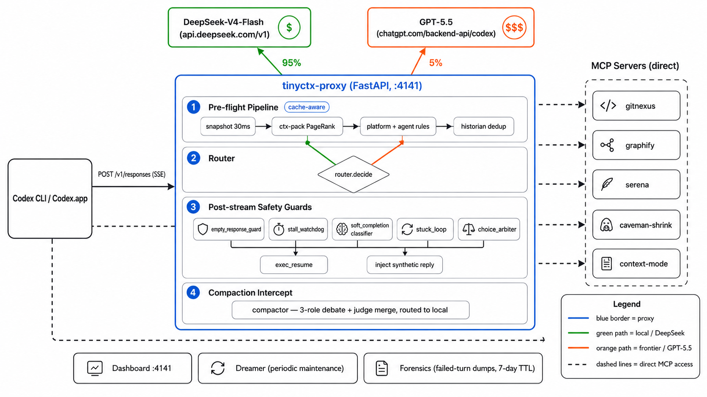

# tinyctx

**Local-first context-routing proxy for OpenAI Codex CLI.** 95%+ of turns run on cheap models (DeepSeek-V4-Flash). Frontier (GPT-5.5) only fires when truly needed. Zero manual config — all integrations auto-install and auto-wire.

```bash
./scripts/install.sh      # one-shot: venv + all MCP servers + codex config
./scripts/start.sh        # starts proxy on 127.0.0.1:4141
codex --profile tinyctx   # uses the proxy as model_provider
```

## Highlights

- **~95% local hit rate in production.** DeepSeek-V4-Flash handles routine turns at ~1/100th frontier cost. Compaction summaries, repeat reads, and tool results never touch GPT-5.5.
- **7 OSS integrations, all auto.** gitnexus (knowledge graph), graphify (code skill), serena (LSP ops), caveman-shrink (compression), context-mode (sandbox), mem0 (memory), LLMLingua-2 — one `install.sh` wires everything.
- **Inline compression pipeline.** Tool descriptions shortened 30-50% via regex rules. Repeat reads collapsed to unified diffs. Cache-aware mutation gates preserve prompt-cache hits.
- **Advisor Strategy built-in.** Classifier detects hard decisions (p≥0.7) → auto-escalates to GPT-5.5 as a sub-agent. executor handles 99% of turns; frontier only sees 1-3 hard calls per task.
- **Live dashboard.** Per-project token stats, MCP call counts, frontier health, route mix, latency percentiles — all at `http://127.0.0.1:4141/dashboard`.
- **DeepSeek native.** `reasoning_content` streaming, tool schema pass-through, chat→responses SSE bridge, codex 0.128+ wire compat — all production-verified at 700+ turns/day.

## Architecture



**Request lifecycle:** pre-flight pipeline (snapshot → ctx-pack → rules → historian) → router decision (95% local, 5% frontier) → SSE relay with tool translation → post-stream safety guards (stall, empty response, stuck loop, choice arbiter) → compaction intercept (3-role debate, never hits frontier).

Codex talks directly to auto-installed MCP servers in parallel: gitnexus · graphify · serena · caveman-shrink · context-mode · pydoc-mcp (offline local Python docs).

## Quick start

```bash
cd ~/dev/tinyctx
./scripts/install.sh                    # idempotent, safe to re-run
cp examples/secrets.env.example ~/.tinyctx/secrets.env
# edit secrets.env → paste your DeepSeek API key

./scripts/start.sh                      # proxy on :4141, dashboard auto-opens
codex --profile tinyctx                 # routes through proxy
codex --profile tinyctx-goal            # for long-running goal mode
```

Dashboard at `http://127.0.0.1:4141/dashboard` — shows token stats, route mix, MCP call counts, project tabs.

## Key numbers

| Metric | Value |
|--------|-------|
| Local hit rate (production) | ~95% |
| DeepSeek-V4-Flash latency | ~5-7 s/turn |
| GPT-5.5 latency | ~20-30 s/turn |
| Compaction redirect saving | 100% (never hits frontier) |
| Tests | 1005 passing, 31 test files |
| Code | ~13K LOC in 71 modules |

## Config

`~/.tinyctx/config.toml` — all defaults work out of the box. Common tweaks:

```toml
[routing]
force_route = "auto"                          # "local" | "frontier" | "auto"
escalate_on_error_streak = 2                  # consecutive errors → frontier
self_classify_escalates_to_frontier = true    # AI decides when to escalate

[local]
base_url = "https://api.deepseek.com/v1"      # DeepSeek API (default)
model = "deepseek-v4-flash"
context_window = 131072

[frontier]
base_url = "https://chatgpt.com/backend-api/codex"
model = "gpt-5.5"
proxy = "direct"                               # or "http://127.0.0.1:10809" for tunnel
```

Secrets (`TINYCTX_LOCAL_API_KEY`, etc.) live in `~/.tinyctx/secrets.env` (chmod 600), never in config.toml.

## CLIs

```bash
tinyctx install          # auto-install all missing components
tinyctx status           # check all component states
tinyctx-stats            # routing summary from logs (--quality for S-F grade)
tinyctx-trace --watch    # live request trace
tinyctx-dreamer run      # periodic maintenance: scout + keypin + GC
```

## Docs

- [docs/install.md](docs/install.md) — full install guide, every backend option
- [docs/features.md](docs/features.md) — complete feature inventory
- [docs/test.md](docs/test.md) — test plan and benchmark suite
- [docs/advisor.md](docs/advisor.md) — Advisor Strategy deep-dive

## Status

v0.8.0 — production use at 700+ turns/day, 95%+ local hit rate, sub-1% upstream errors. Works with Codex CLI 0.125.0 and Codex.app 0.128.0+.

MIT license. ~13K LOC original code across 71 modules. 7 upstream OSS integrations auto-wired.

## Feature catalog

### Safety & recovery guards

Five independent watchdogs catch and auto-resolve session failure modes observed in production.

| Guard | Trigger | Action |
|-------|---------|--------|
| `empty_response_guard` | Upstream returns <5 completion tokens (normal `stop`) | Force next turn to frontier — one-shot retry |
| `stall_watchdog` | No SSE event from upstream for 180s | Declare stall, escalate, notify caller |
| `stuck_loop` | Turn count exceeds 80 on same sub-problem | Inject `<system-reminder>` at recency position pushing advisor consult or user surface |
| `exec_resume` | `soft_completion` classifier returns high-confidence PUNT | Fire `codex exec resume <sid> "<prompt>"` in side process — no user wake-up needed |
| `choice_arbiter` | Agent asks "A or B?" instead of proceeding | Judge (local) extracts options → advisor (frontier) picks → inject synthetic user reply next turn |

### Context engineering pipeline

Six stages run on every request, each cache-aware and prompt-cache-preserving.

| Stage | Module | What it does |
|-------|--------|---------------|
| Snapshot | `snapshot.py` | Inject directory-tree overview in ~30ms — structural context from turn 0 |
| ctx-pack | `ctx_pack.py` | Pre-inject top-K files ranked by compression PageRank → one request replaces N `Read` tool calls |
| Platform rules | `platform_rules.py` | Inject OS-specific shell/path guidance (Darwin / Linux / Windows) |
| Agent rules | `agent_rules.py` | Inject bundled AGENTS.md into every request — rules ship with the proxy, no user config needed |
| Historian | `historian.py` | Collapse repeat reads to unified diffs; dedup tool results |
| Compactor | `compactor.py` | Replace codex single-pass summary with 3-role debate + 1-judge merge |

### Project intelligence

| Tool | What it does |
|------|---------------|
| `interest.py` | Compression-biased PageRank — ranks files by reductive (T₀) + deductive (I₀) compression score |
| `scout.py` | Sub-agent local-model scan of top-K load-bearing symbols → byte-stable summary for AGENTS.md preamble |
| `keypin.py` | Scan rollout JSONL for actual Read-tool frequency → `keyfiles.md` ranked by real usage |
| `continuity.py` | Cross-session compaction recall — `tinyctx-recall` surfaces prior session summaries |

### Multimodal cost optimization

| Module | What it does |
|--------|---------------|
| `multimodal_preprocess` | Replace image attachments with text captions via `mm cat -m accurate` — image-bearing turns stay on cheap local model |
| `mm_bootstrap` | Auto-install vlm-run/mm CLI for image→text captioning |

### Reliability engineering

| Module | What it does |
|--------|---------------|
| `forensics.py` | Full request/response/timing capture for failed turns — 100 dumps max, 10MB each, 7-day retention |
| `escalation.py` | Graduated ladder: REFINE → PIVOT → SEARCH → BLOCKER instead of binary fail→frontier |
| `frontier_health.py` | Frontier reachability tracking with exponential backoff cooldown — auto-recovers when healthy |

### Agent infrastructure

| Module | What it does |
|--------|---------------|
| `session_state` | Unified per-conversation state container — typed API, compaction-reset hooks, no per-module ad-hoc dicts |
| `conv_id` | Stable conversation fingerprint — works around `prompt_cache_key` drift across mid-session identity shifts |
| `plan_persistence` | Persist codex plans to disk keyed by cwd → new sessions pick up where prior ones left off |
| `skill_catalog` + `dynamic_skill` | Task-type → skill routing catalog + LLM-generated dynamic skills |
| `orchestration_injector` + `orchestration_runtime` | Task plan injection into instructions + runtime tracking |

### Self-improvement & policy search

| Module | What it does |
|--------|---------------|
| `eval_harness` | March-of-9s normalized scoring: φ(s) = -log₁₀(\|s − s_opt\| + ε) |
| `self_improvement` | Governed candidate evaluation loop — run benchmark, archive winner, repeat |
| AIRA policy overlay | Policy candidates auto-discovered, scored, archived; winning policy auto-loaded on proxy start |

### Extended CLI surface

```
tinyctx-keypin scan [--top-n 20] [--days 30]   # most-read files from rollout
tinyctx-scout init [--top-k 40]                 # ranked symbol summary
tinyctx-recall                                  # cross-session compaction recall
tinyctx-mem query <text>                        # mem0 memory search
tinyctx-interest [--top-k 30]                   # compression PageRank
python -m tinyctx.mm_bootstrap install|status   # mm CLI management
```

## Technical foundations

Four independent streams of research inform tinyctx's design.

### 1. Compression-biased context ranking

*Aksenov, Bodnia, Freedman, Mulligan — [Compression Is All You Need (arxiv 2603.20396)](https://arxiv.org/abs/2603.20396)*

The central finding: human mathematics lives in the polynomial-growth (A_n) regime, where a small set of hierarchically-nested macros buys exponential expansion. The paper proposes **PageRank with teleportation biased toward high-compression nodes**: nodes whose content compresses well (high reductive compression T_0 = unwrapped/wrapped) and whose signatures are small relative to body (high deductive compression I_0 = body/signature) get more teleportation mass. For a code corpus, this picks the load-bearing abstractions — utility modules, well-named interfaces, deeply-nested but terse APIs — that should be primed into the agent's context.

tinyctx implements this in `interest.py`: build a code graph (gitnexus/graphify), compute J_0 = β·T_0 + (1-β)·I_0 for each node, run compression-biased PageRank, inject top-K files into context. Strictly stronger ranking than uniform-personalization PageRank (what aider's repomap does).

### 2. Prefix reuse as the dominant cost lever

*LMCache project — [Prefix-aware LLM serving](https://arxiv.org/abs/2407.17788)*

The key metric: ~92% of Claude Code traffic is prefix-reuse, climbing to ~98% in execution phase. With Anthropic's 10× prompt-cache read discount, that's ~5-10× cost reduction from cache discipline alone. The implication for a routing proxy: **cache stability dominates every other optimization**. Mutating history bytes before 5 minutes of idle time destroys cache hits worth more than any per-token compression could save.

tinyctx's `CacheAwareMutator` gates every history-mutating transform (dedup, purge, historian substitution, read_delta, caveman compression, LLMLingua) behind dual triggers: 5-minute TTL OR context usage above threshold. In the common case (<5 min between turns, <80% context), the proxy touches nothing and the cache stays hot.

### 3. Agentic policy discovery (AIRA)

*Meta FAIR — [AIRA: Agentic Discovery of Neural Architectures (arxiv 2605.15871)](https://arxiv.org/abs/2605.15871)*

The insight: the draft → evaluate → improve → archive loop that discovers neural architectures can also discover **better proxy routing policies**. Parameterize routing configs (escalation thresholds, tool trim budgets, cache-awareness knobs), evaluate each candidate against deterministic benchmark suites (simulation + real codex execution), archive winners, perturb and repeat.

tinyctx ships this loop offline: `policy_search.py` manages the cycle, `eval_harness.py` scores candidates with march-of-9s normalization (φ(s) = -log₁₀(|s − s_opt| + ε)), `frontier.py` archives scored candidates with lineage. The winning policy is auto-loaded by the proxy on next start.

### 4. The Advisor Strategy

*Anthropic — [The Advisor Strategy](https://claude.com/blog/the-advisor-strategy)*

Instead of all-or-nothing per-request escalation (local model OR frontier model), thread a third path: the executor decides per-turn whether to consult the frontier **as a tool**. 99% of turns run on the cheap model. When the executor hits a hard decision (torn between architectures, 2+ failed approaches, non-trivial security choice), it spawns a sub-agent bound to GPT-5.5, gets 100-200 words of guidance, then continues. Anthropic reports +2.7 SWE-bench points at −11.9% cost using Sonnet+Opus pairing.

tinyctx implements this via codex's native `spawn_agent(role="advisor")` + a `self_classify` classifier that detects hard decisions (p≥0.7) and auto-escalates. The advisor sub-thread's `model="tinyctx-frontier"` forces the proxy to route to GPT-5.5, confirmed in live traces.
