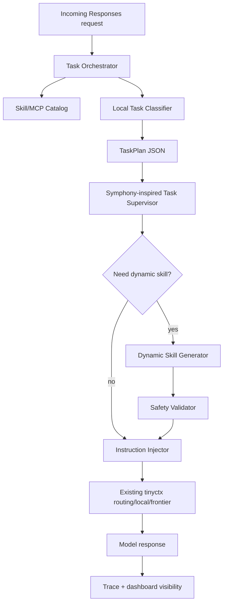
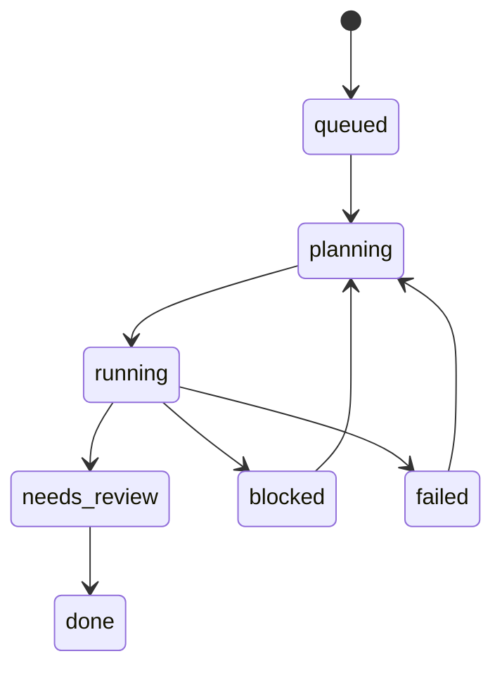

# 自动 Skill / MCP 编排设计

## 结论

在 tinyctx 中新增 **Task Orchestrator**：每个请求进入本地模型前，先由小模型根据任务类型生成一份结构化 `TaskPlan`，选择最合适的本地 Skill、MCP/server 工具提示和执行约束；当没有合适 Skill 但任务明显需要额外方法论约束时，生成一个 **Dynamic Skill** 并以内联 playbook 形式注入当前请求。

第一阶段不要把动态 Skill 写入真实 Codex skill 目录。原因：Codex skill 列表通常在会话/进程加载时确定，中途写入文件不保证当前 turn 生效。MVP 应使用“虚拟 Skill 注入”——把生成的 `SKILL.md` 精简为一个受控 instruction block，仅对本次任务生效。

## 目标

- 自动识别任务类型：代码实现、测试修复、设计、研究、配置、审查、文档、排障等。
- 自动推荐应使用的 Skill 与 MCP：如 `cc-tdd`、`cc-design`、context-mode、gitnexus、serena、browser、advisor。
- 对模型明确“先用什么、不要用什么、何时升级到 frontier”。
- 本地无合适 Skill 时，动态生成轻量 Skill，提升约束性、准确性和流程一致性。
- 生成和注入行为可审计、可关闭、可回放。

## 非目标

- 不让小模型绕过系统/developer/AGENTS 指令。
- 不自动安装任意第三方 MCP 或插件。
- 不把动态 Skill 默认持久化为用户全局 Skill。
- 不让动态 Skill 包含任意 shell 命令、secret 读取、网络抓取或权限提升建议。

## 方案对比

| 方案 | 描述 | 优点 | 风险 | 结论 |
| --- | --- | --- | --- | --- |
| 静态规则匹配 | 关键词触发固定 Skill/MCP | 简单稳定 | 覆盖差、难处理组合任务 | 作为 fallback |
| 小模型分类 + 静态 catalog | 小模型从 Skill/MCP 摘要中选择 | 低成本、可解释 | 可能误选 | 推荐 MVP |
| 小模型生成动态 Skill | 无合适 Skill 时生成临时 playbook | 覆盖长尾任务 | prompt injection/过度自信 | 推荐但需强约束 |
| 自动写入真实 Skill 目录 | 生成 `SKILL.md` 并安装 | 后续可复用 | 当前会话不一定生效，污染全局 | 延后 |

## 架构



## 核心组件

### 1. `skill_catalog.py`

维护可用 Skill 和 MCP 的压缩摘要：

- Skill：名称、触发条件、适合任务、禁用场景、风险等级、来源路径。
- MCP：server、工具能力、适合任务、是否需要安装、是否会产生大输出、是否安全默认启用。
- 来源：内置静态 registry + 可选扫描 `~/.codex/skills`、`.codex/skills`、`~/.codex/config.toml` 的 MCP 配置。

### 2. `task_orchestrator.py`

入口函数：

```text
plan_task(body, cfg, catalog) -> TaskPlan
```

使用本地小模型，要求 JSON-only 输出。失败时回退到规则匹配。

`TaskPlan` 结构：

```json
{
  "task_type": "coding|debug|design|research|review|config|docs|unknown",
  "confidence": 0.0,
  "recommended_skills": ["cc-tdd", "cc-work"],
  "recommended_mcp": ["context-mode", "gitnexus"],
  "dynamic_skill_needed": false,
  "dynamic_skill": null,
  "routing_hint": "local|frontier|auto",
  "constraints": ["test-first", "use context-mode for large searches"],
  "rationale": "short human-readable reason"
}
```

### 3. `dynamic_skill.py`

当 `dynamic_skill_needed=true` 且置信度满足阈值时生成临时 Skill：

- 输入：用户任务、已有 Skill 缺口、repo 信号、AGENTS 摘要。
- 输出：`DynamicSkill`，包含名称、适用范围、步骤、禁止项、验证方式。
- 注入前必须通过 validator。

建议格式：

```markdown
## tinyctx Dynamic Skill: <name>

Scope: current task only.
Use when: ...
Do:
- ...
Do not:
- ...
Verification:
- ...
```

### 4. `orchestration_injector.py`

把 `TaskPlan` 和 Dynamic Skill 注入 `body.instructions`：

- 使用明确 marker：`<!-- tinyctx-orchestrator:start -->`。
- 不覆盖用户/AGENTS/system/developer 指令，只追加“建议使用”。
- 注入内容控制在 1–2 KB。
- 当 local route 发送给 chat backend 时，也经过 `normalize_for_chat` 保持 system 在开头。

### 5. Symphony-inspired `task_supervisor.py`

OpenAI Symphony 的关键价值不是 Linear 本身，而是把“会话”提升为“可监督的任务”。tinyctx 应吸收这层设计，但保持轻量：

- 不接 Linear/Jira 作为 MVP。
- 不为每个任务创建独立 workspace。
- 先把当前 Codex request/session 映射成 `TaskRecord`，让 dashboard、trace、恢复策略有统一对象。

`TaskRecord` 建议结构：

```json
{
  "task_id": "tsk_<hash>",
  "session_id": "global-or-codex-session",
  "project_root": "C:/Dev/tinyctx",
  "title": "short inferred task title",
  "state": "queued|planning|running|needs_review|blocked|done|failed",
  "task_type": "coding|debug|design|research|review|config|docs|unknown",
  "acceptance": ["tests pass", "dashboard route returns 200"],
  "recommended_skills": ["cc-tdd", "cc-work"],
  "recommended_mcp": ["context-mode"],
  "dynamic_skill_hash": null,
  "proof": {
    "tests": [],
    "changed_files": [],
    "trace_ids": []
  },
  "blockers": []
}
```

状态机：



tinyctx 内的用途：

- **任务状态**：把 route/self-classify/soft-completion/stall 事件归并到同一个 task。
- **恢复策略**：当 empty response、stall、失败测试、软结束发生时，按 task state 生成下一步。
- **Proof-of-work**：完成时记录测试命令、trace、文件、截图或 dashboard 验证。
- **Dashboard**：显示当前任务、状态、推荐 Skill/MCP、动态 Skill、阻塞原因。

与 Symphony 的边界：

| Symphony 原设计 | tinyctx 推荐吸收 | 暂不吸收 |
| --- | --- | --- |
| Issue tracker control plane | `TaskRecord` + dashboard task view | Linear/Jira watcher |
| Per-issue workspace | project/session scoped task identity | 自动创建多 workspace |
| Agent runner lifecycle | request/session lifecycle + recovery policy | 独立 app-server runner |
| Proof-of-work packet | tests/trace/files/screenshot summary | PR/CI merge shepherd |
| Long-running daemon | tinyctx proxy 内轻量 supervisor | 全量任务管理系统 |

## 流程

### 普通任务

1. 提取最后用户请求、当前 repo、已有工具列表摘要。
2. 小模型分类并选择 Skill/MCP。
3. 创建或更新 `TaskRecord`，状态从 `queued/planning` 进入 `running`。
4. 注入短提示：推荐 Skill、MCP、验证策略。
5. 原 tinyctx route 决策继续执行。

### 无合适 Skill 的任务

1. 小模型说明“现有 Skill 缺口”。
2. 生成 Dynamic Skill。
3. validator 检查：
   - 不含权限提升/secret/外部任意下载。
   - 不覆盖上级指令。
   - 不要求不可用工具。
   - 步骤可验证。
4. 注入为 current-turn playbook。
5. trace 记录 hash、名称、任务类型、置信度。

### 高风险任务

满足任一条件时不自动生成动态 Skill，改为 advisor/frontier 或只给保守提示：

- 安全/法律/医疗/金融高风险。
- 要求绕过权限、抓取私密信息、修改认证配置。
- 用户明确要求不要自动选择工具。
- 小模型置信度低于阈值。

## 配置

新增配置项建议：

```toml
[orchestrator]
enabled = true
local_model = "local"
min_confidence = 0.62
dynamic_skill_enabled = true
dynamic_skill_min_confidence = 0.78
inject_max_chars = 2000
persist_dynamic_skills = false
trace_decisions = true
```

## Dashboard

在 `/dashboard/config` 后续增加 Orchestrator 面板：

- 开关：启用自动编排、启用动态 Skill、是否持久化。
- Catalog 预览：已识别 Skill/MCP。
- 最近决策：task_type、skills、mcp、dynamic_skill_hash、confidence。
- Task Supervisor：当前 task state、acceptance、proof-of-work、blockers、recovery action。
- 调试按钮：输入一段任务，预览 `TaskPlan`，不真正执行。

## 安全策略

- Dynamic Skill 是建议，不是更高优先级指令。
- 任何动态内容都必须带 `current task only`。
- 默认不落盘；若用户选择持久化，写入 `~/.tinyctx/dynamic-skills/`，并要求人工确认后才复制到 `~/.codex/skills/`。
- 对 prompt injection 做显式过滤：如果用户让动态 Skill 忽略系统/开发者/AGENTS 指令，直接拒绝生成。
- 所有决策写 trace，方便回放和调参。

## 测试点

- `TaskPlan` JSON 解析失败时回退规则。
- coding 任务推荐 `cc-tdd`/`cc-work` 和 context-mode。
- UI/design 任务推荐 `cc-design` 或 `huashu-design`，不推荐无关 MCP。
- 没有匹配 Skill 时生成 Dynamic Skill，并通过 validator 后注入。
- 高风险任务不生成 Dynamic Skill。
- 注入内容不会覆盖 AGENTS，且长度受限。
- dashboard 能显示最近 orchestrator 决策。
- `TaskRecord` 能从请求中稳定生成 task id，并随 session 更新状态。
- stall/empty response/soft completion 能写入 blocker 或 recovery action。
- proof-of-work 能记录测试命令、trace id、变更文件摘要。

## 分阶段实施

### P1：只做选择，不做动态生成

- 建 `skill_catalog.py`、`task_orchestrator.py`。
- 小模型输出 `TaskPlan`。
- 注入推荐 Skill/MCP。
- trace + tests。

### P2：Symphony-inspired Task Supervisor

- 建 `task_supervisor.py` 与 `TaskRecord`。
- 将 route trace、soft completion、stall、empty response 归档到 task state。
- dashboard 显示 current task、state、proof、blockers。

### P3：动态 Skill 内联注入

- 建 `dynamic_skill.py` validator。
- 支持 current-turn virtual skill。
- dashboard 展示决策。

### P4：可选持久化

- 将高质量动态 Skill 保存到 `~/.tinyctx/dynamic-skills/`。
- 提供人工提升为真实 Codex Skill 的命令或 UI。

### P5：外部 issue tracker（可选）

- 仅当本地 task supervisor 稳定后再接 Linear/Jira/GitHub Issues。
- tinyctx 只做 adapter，不把自身变成完整项目管理器。
- 外部 issue 映射到 `TaskRecord`，不改变 Skill/MCP 编排核心。

## 推荐实现顺序

1. Catalog 静态注册表：先覆盖已有 cc-*、context-mode、browser、gitnexus、serena。
2. Local classifier JSON prompt + fallback rules。
3. Instruction injector + trace 字段。
4. Task Supervisor：`TaskRecord`、状态机、proof-of-work。
5. 单元测试和 dashboard 可视化。
6. Dynamic Skill generator + validator。

## 决策

采用 **小模型 TaskPlan + 静态 Skill/MCP catalog + Symphony-inspired Task Supervisor + current-turn Dynamic Skill 注入**。

这条路径最符合 tinyctx 的 compose-first 设计：不替 Codex 真正“执行工具选择”，而是用本地模型在请求前给 executor 注入一份可审计、可验证、可关闭的任务编排建议；用 Symphony 的任务状态机思想补上监督、恢复和 proof-of-work；长尾任务再用动态 Skill 补方法论约束。
