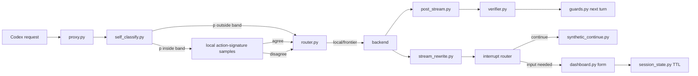

# tinyctx measured escalation technical spec

## 技术背景

已知：
- 路由主链路是 `tinyctx/proxy.py` 组装 `RouteContext`，再由 `tinyctx/router.py::Router.decide` 按规则返回 `Decision`。
- 当前 `self_classify.py` 输出 advisor-needed 概率 `p`，router 只消费 `classify_p/classify_reason`。
- 当前 soft-completion stream rewrite 已能拦截 `response.completed` 并注入 synthetic continue。
- 当前 verifier 已可在 post-stream 低分后通过 `VerifierGate` force 下一 turn 到 frontier。

推测：
- 对边界 p 进行动作签名采样，比直接按单次 p 升级更能守住 local-first 成本曲线。
- 对中断做 taxonomy 后，B5/B7 可以复用同一套 `PendingInputRequest` 状态。

## 总体架构



## 关键数据结构

### A1 self-consistency

最终实现签名：

```python
@dataclass
class ActionSignature:
    action: str          # answer | edit | run | inspect | ask_user | plan | unknown
    target: str          # normalized file/tool/domain label
    confidence: float
    reason: str = ""

@dataclass
class ConsistencyResult:
    samples: list[ActionSignature]
    agreed: bool
    reason: str
```

配置：

```python
self_consistency_enabled: bool = True
self_consistency_boundary_low: float = 0.55
self_consistency_boundary_high: float = 0.85
self_consistency_sample_count: int = 3
self_consistency_timeout_s: float = 20.0
```

RouteContext 增量：

```python
self_consistency_agreed: bool | None = None
self_consistency_reason: str = ""
```

语义：
- `None`：未采样，走现有规则。
- `True`：边界带采样一致，强制留 local。
- `False`：边界带采样分歧，升级 frontier。

### B6 interrupt taxonomy

B5/B7 共用：

```python
InterruptKind = Literal[
    "none",
    "self_answerable",
    "choice",
    "secret_input",
    "external_action",
    "human_judgement",
]

@dataclass
class PendingInputRequest:
    request_id: str
    conv_sid: str
    fields: list[InputField]
    created_ts: float
    ttl_s: float
    resume_mode: Literal["hold_stream", "park_resume"]
```

安全约束：
- secret 值只写 `session_state` 内存，不写 trace。
- trace 只记录 `request_id`、字段名、字段类型、TTL，不记录值。
- `sanitize_encrypted_content` 继续处理上游 encrypted content。

### A4 verifier action

最终实现：

```python
@dataclass
class VerificationAction:
    action: Literal["none", "continue_verify", "local_rewrite", "frontier_next"]
    reason: str
    criteria: VerdictCriteria
```

建议策略：
- `execution_evidence <= 2` 且 task 仍可本地验证：`continue_verify`。
- `task_completion <= 2`：`frontier_next` 或 A2 local parliament。
- `output_quality <= 2`：先 local rewrite，连续低分再 frontier。

## 接入点 diff 草图

### `tinyctx/self_classify.py`

```diff
+ @dataclass
+ class ActionSignature: ...
+ @dataclass
+ class ConsistencyResult: ...
+ def parse_action_signature(text: str) -> ActionSignature | None: ...
+ async def sample_action_signatures(..., sample_count: int) -> ConsistencyResult | None: ...
```

实现要点：
- prompt 只要求"下一步决定性动作签名"，不要求解题。
- 每个 sample 使用本地 backend，小 token cap。
- normalize key = `(action, target)`；多数一致即 `agreed=True`。

### `tinyctx/proxy.py`

```diff
  sc = await self_classify.classify(...)
  if sc is not None:
      trace.self_classify_p = sc.p
+     if boundary_low <= sc.p <= boundary_high:
+         consistency = await self_classify.sample_action_signatures(...)
+         trace.self_consistency_agreed = consistency.agreed
+         trace.self_consistency_reason = consistency.reason
```

实现要点：
- 只在无更高优先级 router rule 且 p 在边界带时运行。
- sampler 失败时回退现有 classify 行为。

### `tinyctx/router.py`

```diff
  for rule in (
      self._compaction_rule,
      self._force_route_rule,
      ...
      self._capacity_rule,
+     self._self_consistency_rule,
      self._classify_rule,
      self._default_rule,
  ):
```

规则：
- `self_consistency_agreed is True` → local，reason 写明 agreed。
- `self_consistency_agreed is False` → frontier，reason 写明 disagreement。
- `None` → 不处理。

### `tinyctx/soft_completion.py` + `stream_rewrite.py`

```diff
- {"soft_punt": true|false, "p": 0.0-1.0, "reason": "..."}
+ {"soft_punt": true|false, "p": 0.0-1.0, "interrupt_kind": "...", "reason": "..."}
```

后续 B6 使用：
- `choice` → `choice_arbiter.py`
- `secret_input` → `dashboard.py` 表单
- `self_answerable` → synthetic continue
- `human_judgement/external_action` → 允许真正中断

### `tinyctx/dashboard.py`

```diff
+ GET  /api/v1/pending-input/{request_id}
+ POST /api/v1/pending-input/{request_id}
+ GET  /api/v1/state includes pending_inputs
+ /dashboard renders pending-input password/text form
```

实现要点：
- status/state/snapshot 只返回字段元数据，不返回提交值。
- 表单按字段 type 渲染，`password` 字段在 UI 中掩码。
- 提交后值留在 `pending_input.py` 的 session_state 内存命名空间；`PendingInputGuard` 成功注入下一 turn 后才消费。

## 方案对比

### 方案 1：按单次 classifier p 升级

优点：
- 已有实现，延迟最低。
- 行为简单。

缺点：
- p 边界处误差最大。
- 单次判断容易把"看起来复杂"误当"必须 frontier"。

### 方案 2：边界带本地自一致性采样

优点：
- 只在不确定区间加本地成本。
- 分歧成为可观测升级理由。
- 和 local-first 红线一致。

缺点：
- 推测：动作签名一致不等于最终答案正确。
- 增加 2-3 次本地调用延迟。
- 需要 trace replay 校准边界带。

选择：
- 采用方案 2，先做窄边界带、可关闭、可观测实现。
- B 侧采用 park/resume 优先的安全切片，不依赖未实测的长时间 SSE hold-stream。

## 风险与缓解

- 风险：sampler prompt 不稳定，输出不可解析。
  缓解：解析失败不改变现有路由；加 fallback regex 与单元测试。
- 风险：边界一致时阻止原本有益的 frontier。
  缓解：只在边界带覆盖；非边界高 p 仍走现有 `_classify_rule`。
- 风险：分歧过多导致 frontier 成本上升。
  缓解：默认 sample_count=3、边界带窄、trace 统计后再调参。
- 风险：现有 dirty worktree 包含同文件改动。
  缓解：补丁只追加字段/规则，不重排无关代码。
- 风险：pending input secret 被状态 API 或 trace 泄漏。
  缓解：status/snapshot/dashboard 响应全部 scrub；trace 只记录 request_id 和字段名；提交值只在 consume 结果和 synthetic input 中出现。
- 风险：retrieval fan-out 读取 workspace root 外文件。
  缓解：mentioned path resolve 后必须保持在 root 内；symlink escape 跳过。
- 风险：公开模型 id `gpt-5.5` 被误判为显式 frontier。
  缓解：router 只把 `tinyctx-frontier` 当强制 frontier。

## 验证设计

单元测试：
- `tests/test_self_classify.py`
  - 解析完整 JSON action signature。
  - 解析缺失/异常 JSON 返回 None。
  - 多数一致判定 `agreed=True`。
  - 三个不同动作判定 `agreed=False`。
- `tests/test_router.py`
  - `self_consistency_agreed=True` 在 `classify_p>=threshold` 时仍 local。
  - `self_consistency_agreed=False` 在边界时 frontier。
  - compaction/force_route/explicit model 仍优先。
- `tests/test_config.py`
  - 默认值与 routing namespace 映射。
- `tests/test_choice_arbiter.py` / `tests/test_choice_arbiter_integration.py`
  - 固定议会角色。
  - 无多数/非法输出返回 None 并触发 advisor fallback。
- `tests/test_retrieval_fanout.py`
  - mentioned path + scout cache provider。
  - 跨 provider 去重和 source merge。
  - symlink escape 不注入 root 外内容。
- `tests/test_soft_completion.py`
  - interrupt taxonomy 解析。
  - `secret_input` 即使伴随 `soft_punt:false` 也强制进入输入收集。
- `tests/test_pending_input.py` / `tests/test_dashboard_api.py` / `tests/test_guards.py`
  - pending input create/status/submit/consume。
  - API 和 dashboard 状态不泄漏提交值。
  - 注入失败不消费，成功注入消费一次。
- `tests/test_verifier.py`
  - verifier action 分项策略。
  - 连续低 output quality 第二次升级 frontier。

集成验证：
- fake local backend 返回 3 个 action signatures，确认 proxy trace 字段和 router reason。
- replay 历史 traces，离线统计：
  - 边界带覆盖率。
  - 分歧率。
  - 分歧后人工介入/失败率。

已完成验证：
- 全量 `uv run pytest` 通过。
- spec 合规复审 PASS。
- code quality 复审 PASS。
- `graphify update .` 已运行。

B5/B7 专项仍待实测：
- SSE park 30s/60s/120s 上限。
- dashboard 未打开时的用户可见性。
- secret 值 trace scrub。

## 实施顺序

1. A1 配置 + data structures + parser/consensus。
2. A1 router rule + proxy hook + trace 字段。
3. A2 fixed-role parliament + stalemate advisor fallback。
4. A3 safe local retrieval fan-out。
5. A4 verifier action loop。
6. B5/B6/B7 pending input API/dashboard/guard。
7. regression fixes：公开模型 id 不强制 frontier、symlink escape、pending input 注入失败不消费、重复低质量升级。
8. 全量测试 + `graphify update .`。

## 参考资料

- `docs/architecture.md`
- `tinyctx/proxy.py`
- `tinyctx/router.py`
- `tinyctx/self_classify.py`
- `tinyctx/choice_arbiter.py`
- `tinyctx/verifier.py`
- `tinyctx/soft_completion.py`
- `tinyctx/stream_rewrite.py`
- `tinyctx/session_state.py`
