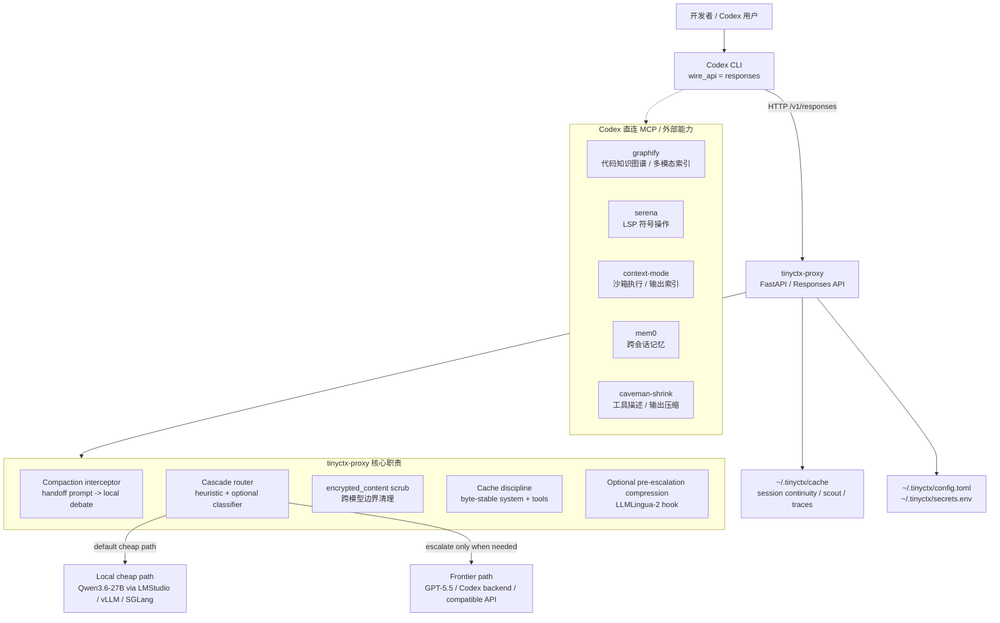
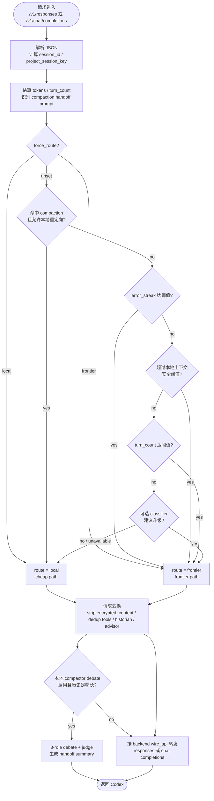
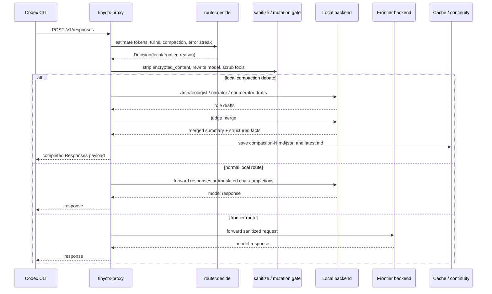
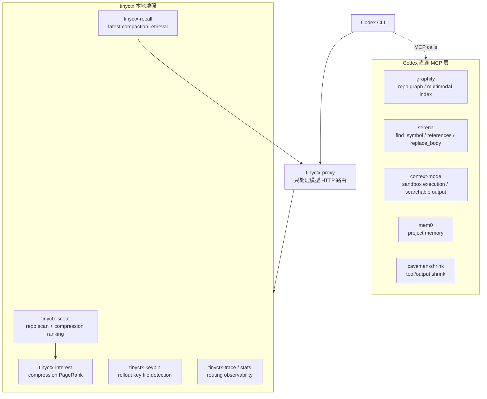
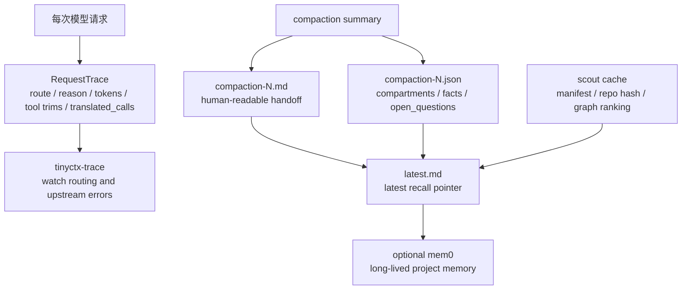

# tinyctx 产品技术方案图表

> 图表依据：`README.md` 的架构说明，以及 `tinyctx/proxy.py`、`tinyctx/router.py`、`tinyctx/compactor.py`、`tinyctx/continuity.py` 的实现路径。以下 Mermaid 块可直接在支持 Mermaid 的 Markdown 预览器中渲染。

## 1. 产品技术全景架构

## 2. 请求路由决策流

## 3. Responses API 处理时序

## 4. Compaction Debate 产物链路

```mermaid
flowchart LR
    handoff["Codex handoff-summary request"]
    history["_flatten_history<br/>剥离原始单次压缩指令"]

    subgraph Roles["并行本地草稿"]
        archaeologist["archaeologist<br/>保留路径 / 决策 / 错误等硬事实"]
        narrator["narrator<br/>重建工作故事线"]
        enumerator["enumerator<br/>列出 artifacts / TODO / risks"]
    end

    judge["judge<br/>合并为结构化 handoff"]
    parse["parse_judge_output<br/>markdown + JSON sidecar"]
    save["save_compaction<br/>compaction-N.md / .json / latest.md"]
    payload["build_responses_api_payload<br/>伪装为完成的 Responses 输出"]
    fallback["fallback_concat<br/>judge 失败时合并幸存草稿"]

    handoff --> history --> Roles --> judge --> parse --> save --> payload
    judge -.失败.-> fallback --> parse
```

## 5. MCP 与上下文治理拓扑

## 6. 持久化与可观测性数据流

