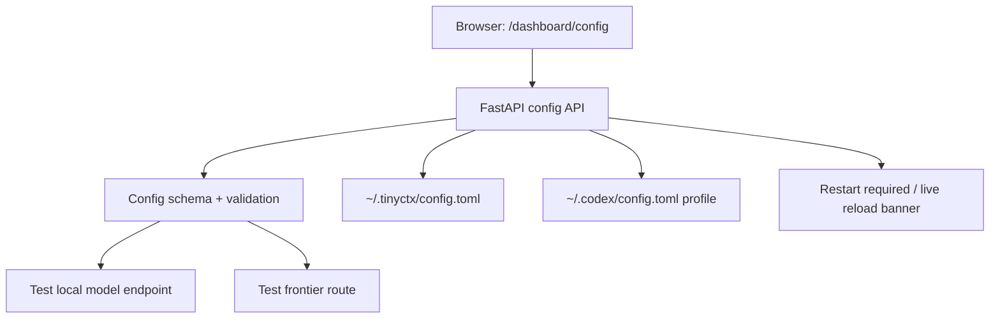

# tinyctx 可视化配置方案

## 结论

最佳方案：在现有 `/dashboard` 内新增 **Config Center**，作为 tinyctx 的内置 Web 配置页。

不推荐先做 Electron/桌面 App，也不推荐只做 TUI。tinyctx 已经有 FastAPI + 单页 dashboard，继续扩展它成本最低、部署最稳、最符合当前用户路径：启动 proxy 后打开 `http://127.0.0.1:4141/dashboard/config`，即可编辑、校验、保存配置。

## 目标用户问题

当前配置依赖手写 `~/.tinyctx/config.toml` 和 `~/.codex/config.toml`，容易出现：

- 不知道 local/frontier/routing 哪些字段该改。
- API key、Bearer header、Codex 官方后端认证边界容易混淆。
- 改完配置不知道是否生效、是否需要重启。
- LMStudio / DeepSeek / OpenRouter / Codex 官方等配置模板需要手动复制。

## 方案对比

| 方案 | 优点 | 缺点 | 结论 |
| --- | --- | --- | --- |
| Dashboard 内置 Config Center | 复用现有 FastAPI、零新依赖、远程/本机都可用、可直接做 API 校验 | UI 需要在现有 dashboard 里维护 | 推荐 |
| 独立 TUI `tinyctx config` | 终端用户友好、实现较快 | 不够“可视化”，字段关系难表达 | 作为后续补充 |
| Electron/桌面 App | 体验最好 | 依赖重、打包复杂、偏离 tinyctx 轻量定位 | 暂不做 |
| VS Code/Codex 插件 | 与工作流贴近 | 插件生态和安装路径复杂 | 后续探索 |

## 推荐架构

## MVP 范围

### 页面

- 新增 `/dashboard/config`。
- 左侧 preset：LMStudio、DeepSeek、OpenRouter、Codex official frontier。
- 中间表单：server、routing、local、frontier 四组核心字段。
- 右侧状态：当前生效值、env override 提示、最近一次 test result。

### API

- `GET /api/v1/config`：返回当前 TOML、解析后的有效配置、字段 schema、env override 状态。
- `POST /api/v1/config/validate`：仅校验，不落盘。
- `POST /api/v1/config/save`：原子写入 `~/.tinyctx/config.toml`，保留未知字段和注释尽量不丢。
- `POST /api/v1/config/test-local`：测试 local `/models` 和最小 chat/responses 请求。
- `POST /api/v1/config/test-frontier`：检查 frontier base/wire/model 配置，不要求 `OPENAI_API_KEY`。

### 安全边界

- 默认只监听 `127.0.0.1` 时允许写配置。
- 非 localhost 或 host 非 loopback 时只读，除非显式开启 `TINYCTX_DASHBOARD_WRITE=1`。
- secrets 不显示明文：只显示 env var 名、是否存在、末尾 4 位指纹。
- 保存前写 `.bak`，再用临时文件原子替换。

## 配置模型

第一阶段不要发明新格式，继续以 TOML 为事实源：

- UI 读写 `~/.tinyctx/config.toml`。
- `Config` dataclass 继续是运行时事实源。
- UI schema 从手写 registry 开始，避免 dataclass 注释解析过度复杂。
- 未纳入 UI 的高级字段保留在“高级 TOML 编辑器”里。

## 实施顺序

1. 抽出 `tinyctx/config_io.py`：读取路径、解析 TOML、原子保存、生成备份。
2. 新增 `tinyctx/config_schema.py`：字段元数据、preset、校验器。
3. 扩展 `dashboard.register()`：挂载 config API 和 `/dashboard/config`。
4. 添加单页 HTML/JS：preset、表单、校验、保存、测试按钮。
5. 添加 tests：schema、保存原子性、env override、安全只读、local test mock。
6. 更新 README：从“复制 TOML”改成“打开 Config Center”。

## 成功标准

- 新用户不用手写 TOML 就能完成 LMStudio + Codex official frontier 配置。
- 配错 base URL、wire API、model、Authorization 时 UI 能给出明确错误。
- 保存配置不会破坏未知字段和现有高级配置。
- Windows 路径、global tunnel proxy、ChatGPT Codex 官方后端都能被正确表达。

## 决策

选择 **Dashboard 内置 Config Center + TOML 事实源 + preset 向导 + test connection**。

这是当前 tinyctx 的最短闭环：既解决用户配置痛点，又不引入沉重前端栈；MVP 可以很快做，后续再把同一套 config API 复用给 TUI 或插件。
